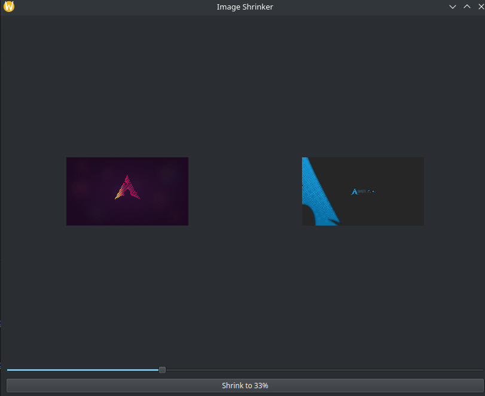
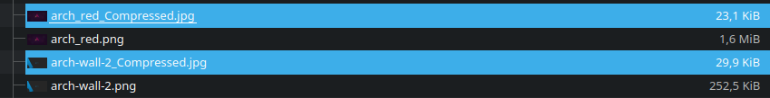

# Setup

```
python -m venv venv
source venv/bin/activate
pip install -r requirements.txt
```

# Build

```
pyinstaller app.py --name ImageShrinker --onefile -w
```

# Usage

Drag and drop multiple images, adjust slider for shrink level. Button will generate the images in same folder, with '_compressed' added to name.  
Can handle jpg, png and webp images. (png's will be converted to jpg as they are losless).  

# Example





# Notes

Uncomment pyqt6-tools to gain access to QT designer. Open from `./venv/Lib/site-packages/qt6_applications/Qt/bin`.  
**Remark**: at time of writing only works with python 3.9. Edit venv an requirements.txt as needed.  
